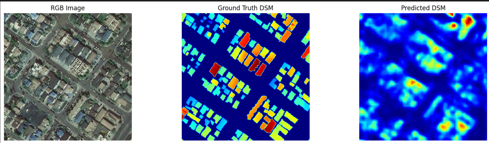
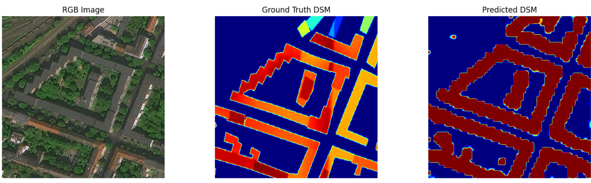

# Building Height Estimation

This project directory contains 5 folders, each containing one notebook (besides experiments)

- Dataset
- Baseline
- Improvement 1
- Improvement 2
- Experiments

We'll walk through each folder, explaining what that notebook does.

## Dataset

The dataset used was the DFC-2023 one - Track 2 data for image segmentation and building height estimation. The satellite data is preprocessed and displayed in this notebook.

It contains over 1800 samples of various locations around the world. For each sample, it has

- RGB image - 3 bands
- SAR data - 1 band
- DSM data - 1 band

We use DSM as ground truth. We load, preprocess, and display the RGB and SAR data, along with RGB+SAR overlap, RGB+DSM overlap, and SAR+DSM overlap for better analyzing and figuring out what data to use. The HGDNet implementation we followed in our final improvement did not use SAR data. We however, the reasoning for which is described fully in our notebook.

Originally, we were using the DFC-2018 Dataset per Maam Sana's recommendation, however we later preferred the DFC-2023 dataset as it was of better, higher quality with images of locations around the world along with accompanying SAR data. Further, the models we tried to follow, that had the best evaluation metrics, and also the baseline we later adapted, were trained on this dataset.

### For each implementation, we will discuss the following:

- Dataset + Preprocessing
- Model Architecture
- Evaluation metrics

## Baseline

Our baseline model was taken from the [DFC-2023](https://github.com/AICyberTeam/DFC2023-baseline).
Our three delivarables differ in pre-processing of data, and model architecture.

### Pre=processing

For the baseline, the pre-processed data only included RGB data for the model to train on - no SAR data. The DSM values were normalized by simply dividing by 184 (maximum height in the dataset).

### Model Architecture

The architecture consists of four main parts:

- **Initial convolution stem:** A series of convolution layers with batch normalization and ReLU activation for low-level feature extraction.
- **ResNet backbone:** Four feature extraction layers using Bottleneck blocks with dilated convolutions to preserve spatial resolution while increasing the receptive field.
- **PSP Module:** Applies adaptive pooling at grid sizes (1, 2, 3, 6) to the output of the fourth layer, processes each with a 1×1 convolution, upsamples them back to the original resolution (512×512 in our case), and concatenates them with the original feature map to enrich contextual information.
- **Segmentation head:** Two convolutional layers followed by a sigmoid activation that produces a pixel-wise prediction mask for binary segmentation.

We trained the model for 30 epochs. The loss criteria was Mean Square Error. The optimizer used was Adam (the dataset size was too small to be using SGD). The learning rate was set to 1e-4.

### Results

The results were: Final Test RMSE: 0.0312 | MAE: 0.0182

Accounting for scaling (dividing DSM values by 184), these values lead to 5.7408 for the Root Mean Square Error and 3.34 for the Mean Absolute Error.
We decided on these evaluation metrics after meeting with Maam Sana, as these were the standard for building height estimation projects.

The outputs were promising. On discussion with Maam Sana, it was decided to make changes to the model to improve segmentation, as it was the clear issue in our outputs.

## Improvement 1

In order to improve the image segmentation of the model, we opted to change the model completely, focusing instead on a DeepLab_3 like implementation.
We also added SAR data as input to the model to better help with the image segmentation. This was experimental, we ran the same model twice, once with SAR data, once without, and we noticed the one with SAR data performed better. Further reasons for inclusion of SAR data are discussed in the Dataset notebook.

### Pre-processing

RGB same as baseline, normalized by subtracting 128 from each band. SAR data, newly included. DSM values: no longer normalized.

### Model Architecture

The architecture again consists of four main parts:

- **Convolutional stem:** Similar to baseline, a convolution stem - Three initial convolutional layers followed by max pooling to extract low-level features from the now 4-channel input.
- **ResNet backbone:** Again, similar to Baseline, four deep Resnet-101 layers for feature extraction.
- **ASPP Module:** The main change. Atrous Spatial Pyramid Pooling applies convolutions with multiple dilation rates and global average pooling, enriching the high-level features with diverse receptive fields before concatenation and dimensionality reduction.
- **Segmentation head:** Two convolution blocks followed by a final ReLU activation layer for output.

The shift from sigmoid to ReLU came about as we figured sigmoid would bunch values either around 0 or 1. By using RelU, we ensured that not only heights could now no longer be negative, but more importantly, there was no inherent bias towards going to one end or the other, especially considering that the max building height - 183 meters - was an outlier, and that most buildings were clustered either around the 10 meter mark or 40 meter mark. Rarely did building heights exceed 100 meters even.

The loss criteria now was SmoothL1loss. The optimizer was again Adam and the learning rate was set to 1e-3.

### Results

This time, we incorporated delta metrics, as those were used by the DFC-2023 winners as well. Delta metrics calculate accuracy based on how close each predicted pixel value was to its actual height. Delta 1 measures those within 25% of the original building height. Delta 2 measures within 56%. Delta 3 measures 95% (1.25, 1.25^2, 1.25^3 respectively). We also kept RMSE and MAE measures. Here are the results:

Final Test RMSE: 6.0782 | MAE: 2.5996
Final Test δ Metrics — δ₁: 0.5174 | δ₂: 0.5381 | δ₃: 0.5527

Furthermore, our outputs are now as:

This is a marked improvement from last time, with much better building detection. The segmentation issue discussed with Maam Sana has been addressed.
The issue now is that the model now predicts, for each image some height, that it now assigns to (almost) every pixel classified as part of a building in the output. That, or some value close to it. While per image these values change, inside each image they do not differ much. This is problamatic obviously in places where there are multiple buildings of varying heights. In places like housing societies where building heights are close to each other, the model does well.

Now the issue becomes, we have successfuly detected buildings and their average heights for the most part. How do we improve on this? A couple of ideas were proposed, changes in both architecture and preprocessing that we discuss in improvement 2.

## Improvement 2

For this improvement, we looked towards the implementation of [HGDNet](https://arxiv.org/pdf/2308.05387v1). We implemented two key ideas from it - Log-normalization of DSM values along with the introduction of a hierarchical height classifier to guide the regression model.

### Pre-processing

Multiple changes in both SAR and DSM

- SAR: Log normalized SAR data, then centered it around mean.
- DSM: Log normalized DSM values

These changes come as we noticed clustering of values for both SAR and DSM at random intervals (e.g. 10m, then 40m for DSM and so on)

### Model Architecture

Same as before with one key change: introduced a DSN outout after layer 3 of the ResNet Block. This deep supervision output was introduced to add hierarchical height detection to the model. In the training loop, we use this DSN output to classify whether the height of the building falls into one of four categories, ground (0-2.5 meters), low (2.5-10 meters), medium (10-36 meters), high (>36 meters). During inference, the regression branch is used.

### Results

## Experiments

This folder just contains various notebooks we used to experiment different models, preprocessing techniques, and final activation heads.

Here's a list of each notebook and the corresponding experiment

- **hgdnet-copy-azaan-outputs:** Our attempt at following HGDNet's implementation, following it to the best of our capabilities. We used a pretrained ConvNext-V2 base for the encoder, and UperNet for the decoders with a PSP module at the start. We had one decoder for hierarchical height estimation and one for regression estimation. The delta metrics are a bit off due a programming error (no expm1 during inference :<), but the RMSE and MAE errors are higher than ours anyways despite taking 4 more hours to run
- **ibrahim-building-height-log-normalized-dsn-simple:** An attempt at improvement 2 using Softplus activation function. We figured since we were using log-normalized DSM values, using softplus would be a good function instead of ReLU and Sigmoid, since it's really just a smoother ReLU. Unfortunately, it led to worse results :(
- **Log_improvement_ibrahim:** Using log normalization on DSM values with the same model as Improvement 1. This led to an increase of 5% in delta metrics, although RMSE and MAE values were worse. Final Test RMSE: 6.3394 | MAE: 2.7256. Final Test δ Metrics — δ₁: 0.5656 | δ₂: 0.6252 | δ₃: 0.6632
- **dl-proj-improvement1 (1):** An attempt to at the first improvement, using Sigmoid as the final activation. We used these experiments to settle between sigmoid, softplus, and ReLU, eventually settling on ReLU as the best final activation function.

Many more experiments, but showing just these four for now :p
